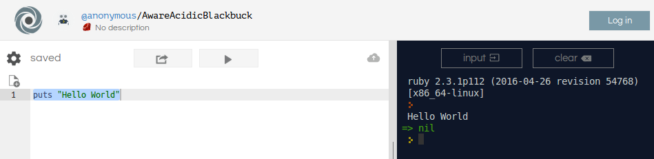

# Programación {#program}
This is the intro

## Lenguaje Ruby
Ruby es un lenguaje de programación creado en en 1993 por el japonés Yukihiro Matsumoto , más conocido como Matz. Es un lenguaje interpretado y totalmente orientado a objetos que se caracteriza por la simplicidad de su código, por la productividad y porque los desarrolladores disfrutan utilizándolo.

## Preparación del entorno
Hay distintas formas de hacerse con un entorno de desarrollo Ruby. Hoy en día, teniendo acceso a internet ni si quiera es necesario instalar nada. Veamos algunas de las opciones:
### Entorno de desarrollo online
Con un navegador y acceso a internet, basta con ir a
[Repl.it](https://repl.it/languages/ruby)
Se trata de un editor online donde se puede escribir código Ruby (entre otros lenguajes) y al pulsar Run veremos el resultado en la pantalla de la lado.



Conviene hacerse una cuenta para poder guardar los trabajos realizados. Existen otros entornos más simples y otros más profesionales como [Codenvy](https://codenvy.com), pero este es un termino medio que permite incluso proyectos con varios ficheros.

### En Windows
Para poder ejecutar Ruby directamente en nuestro equipo, en el caso de Windows debemos descargarnos el instalador en [Rubyinstaller](https://rubyinstaller.org/)
Gracias al instalador, que se ejecuta paso a paso y no tiene ningún misterio, obtendrás soporte para Ruby de forma simple.

### En Linux
Si utilizas Linux, basta con que utilices tu gestor de paquetes para instalar Ruby, que está disponible en todos los sabores de los sistemas unix-like.

### En Mac
En los sistemas Mac ya debería venir instalado, si no es así
puedes echar mano del gestor de paquetes brew para instalar Ruby o cualquier otro software.

### Editores
Qué editor de código se puede utilizar para programar  
Como editores de código, podemos utilizar muchos, algunos de ellos disponibles para todas las plataformas


| Nombre      |  Windows | Linux | Mac | Plugins |
|-------------|:--------:|:--------:|:-----:|-------:|
| [Atom](https://atom.io/)| x | x | x | |
| [Sublime](https://www.sublimetext.com/)| x | x | x | |
| [Visual Studio Code](https://code.visualstudio.com/) | x | x | x | [vscode-ruby](https://github.com/rubyide/vscode-ruby)|
| [Scite](http://www.scintilla.org/SciTEDownload.html)| x | x | x | |
|[Notepad++](https://notepad-plus-plus.org/download/) | x |  |  | |
|[Textmate](https://notepad-plus-plus.org/download/) |  |  | x | | |

El más ligero de todos es Scite, y basta con escribir y código y pulsar F5 para ejecutar los programas.

### Ejecutando programas manualmente
Según el editor, podrás ejecutar el código directamente en él. Si no es así, tendrás que hacer lo siguiente.

- Crear un fichero con código ruby y guardarlo con extensión rb.
- Abrir un intérprete de comandos allá donde hayas guardado el fichero Tecla Win, escribir cmd y pulsar enter.

```shell
c:\ ruby nombre_fichero.rb
```
Esta forma es la manual y no es la forma más ágil de programar. Es preferible usar cualquier de los editores mencionados anteriormente.

## Hello World
Este sería el programa Ruby más simple, y con el que tradicionalmente todo el mundo debe iniciarse en un lenguaje.

```ruby
puts "Hello World"
```

## irb
La forma más rápida de probar código Ruby es utilizando su shell o intérprete. Si ya tienes un entorno Ruby instalado, simplemente ejecuta en la línea de comandos:
```bash
irb
```
Y se abrirá el intérprete de Ruby, donde se puede escribir código Ruby y ejecutarlo de forma inmediata.
```ruby
irb(main):001:0> puts 'Hello'
Hello
=> nil
irb(main):002:0> 40 + 2
=> 42
irb(main):003:0>

```
Es una manera ideal de poder probar sentencias del lenguaje de manera ágil, sin necesidad de crear un fichero.

## Comentarios
Los comentarios en Ruby pueden ponerse de diferentes maneras. La más simple es utilizando el símbolo almohadilla o hash. Todo lo que vaya detrás de ese símbolo es ignorado por el intérprete de Ruby.

```ruby
# This is just a comment

# puts 'This will not appear'
# This will show up:
puts 'Hello'
```
A veces se precisan comentarios más largos de varias líneas. De manera alternativa, en Ruby pueden crearse entre los símbolos =begin y =end.
```ruby
=begin
This is also a
comment in your
code
=end
```
También se admiten comentarios así, de varias líneas
```ruby
"This is just
a multiline
comment"
```
Otra manera de comentar es utilizando estos símbolos
```ruby
<<-DOC
Esto es un comentario
DOC
```
También todo aquello que se ponga tras la siguiente marca se considerará como un comentario.
```ruby
__END__
```
En general, si se siguen las buenas prácticas de la comunidad Ruby, los comentarios preferidos son lo que simplemente utilizan las almohadillas, incluso para comentarios de varias líneas.

## Variables
Ruby es un lenguaje interpretado que no necesita que las variables se declaren como un tipo determinado: numérico, cadena, etc.

Las cadenas, textos o strings pueden ir entre comillas dobles o simples.

```ruby
name = 'Eugene'
surname = "Krabs"
```
Al igual que en otros lenguajes, existen determinados caracteres especiales que se aplican con la contrabarra o backslash.

Los números pueden ser enteros, con decimales, y en caso de números grandes, pueden utilizarse los guiones bajos para marcar

```ruby
number = 42
weight = 67.34
salary = 10_000_000
```

Los variables booleanas, solo pueden contener dos valores: true (verdadero) o false (falso).

```ruby
i_will_die = true
i_am_inmortal = false
```
Para mostrar el contenido de una variable en un mensaje, se debe encerrar dentro del símbolo #{}
```ruby
puts "#{number} is the meaning of life"
```

Tambíen se pueden hacer asignaciones múltiples de variables:
```ruby
a, b, c = 0, 3, 2
puts b  # 3
```
Las *constantes* son variables cuyo valor no debe cambiar nunca. En ruby se declaran de forma implícita poniendo, al menos, el primer caracter en mayúscula.
```ruby
Pi = 3.1415
```

Pese a que Ruby no declara los tipos de variables, el lenguaje es fuertemente tipado y en el momento de hacer operaciones
no permitirá operar con variables que contengan tipos incompatibles.
```ruby
weight = 56.73
weight = "hola"
```
## Símbolos
Mención aparte merecen los símbolos en Ruby. Los símbolos permiten hacer lo mismo que hace una cadena o String, pero al utilizarlo como símbolo, no se crea una copia del string. Es una referencia única y de ahí el nombre 'símbolo'. ¿Cuándo usarlo? es frecuente hacerlo como clave en las estructuras de hash que veremos en adelante.
Los símbolos en ruby son palabras precedidas de ':'.

```ruby
:total
```
### Conversiones
En ocasiones necesitaremos hacer conversiones de tipos. En Ruby disponemos de una serie de métodos que se pueden aplicar a las variables y a las expresiones para hacer esa conversión:
- to_s: convierte a string
- to_i: convierte a número entero

## Entrada/Salida básica
Cuando se hacen programas que se ejecutan en una consola o en un interprete de comandos o en un entorno online como repl.it, se necesitan medios para poder mostrar mensajes al usuario. La forma más directa de mostrar mensajes en Ruby es mediante la instrucción puts

### Entrada de datos
Si lo que se necesitamos es que el programa solicite datos al usuario para escribirlos, utilizamos la instrucción gets. Al meter esta instrucción la ejecución del programa se detiene hasta que el usuario pulse enter. En ese momento, todo lo que haya escrito se almacenará en la variable que se haya especificado, por ejemplo:
```ruby
puts "please tell me your age"
age = gets
puts "You entered #{age}"
```
1.  El programa saca un mensaje pidiendo la edad.
2.  Mediante gets el programa queda a la espera de que se escriba y una vez se pulsa enter el valor que escribe el usuario se guarda en la variable age.
3.  El programa saca un mensaje con el valor de la variable age.

Hay que tomar precauciones al leer datos del usuario:

- Por normal general, no hay que fiarse de lo que escribe el usuario, ya sea por despiste o por maldad.
- En el caso de Ruby, la lectura incluye el caracter enter.
- En el caso de Ruby, todo lo que se lee se considerará de tipo String


Si queremos solicitar un dato al usuario y queremos que se guarde directamente como un número, podemos hacer lo siguiente:
```ruby
puts "please tell me your age"
age = gets.chomp.to_i
puts "You entered #{age}"
```
La instrucción chomp corta el último caracter de lo que escribe el usuario (la tecla enter) y to_i lo convierte a entero.
*¡OJO!* si el usuario introduce un valor no numérico, el programa se detendrá.

## Operadores
Los operadores nos permiten realizar distintos tipos de operaciones entre valores, variables y todo tipo de expresiones, siempre que los tipos sean compatibles entre si.
Los operadores en Ruby no se diferencian mucho de la mayoría de lenguajes de programación.

### Aritméticos
```ruby
# +, -, *, /, %, **
a = 10
b = 2
c = 3

result = (a + b) * c   # 36
puts result
a = 2
b = 4
c = a % b

puts a % b             # 2
puts a ** b            # 16
puts 10 / 7            # 1
puts 10.0 / 7          # 1.42857...
puts 10 / 7.0          # 1.42857...
```
En el caso de precisar otros operadores, se puede recurrir a los recursos del lenguaje Ruby.

### Operadores booleanos
Los operadores booleanos básicos son:

- &&: operador _and_, solo si ambos operandos son true el resultado es true.
- ||: operador _or_, basta con que uno de los operandos sea true para que el resultado sea true.
- !: operador _not_, niega el valor booleano y devuelve lo contrario.

```ruby
# &&, ||, !
a = true && true       # true
b = false || true      # true
c = !false             # true

puts b
```

### Operadores de comparación
Los operadores de comparación permiten comparar distintos valores numéricos e incluso cadenas. El resultado de las operaciones de comparación es un valor booleano.
Los operadores son los clásicos:

- == igualdad.
- != desigualdad.
- \> mayor que.
- \>= mayor o igual que.
- < menor que.
- <= menor o igual que.

```ruby
# ==, !=, <, >, <=, >=
result = 5 == 1    # false
result = 5 == '5'  # false
result = 5 == 5.0  # true
result = 5 > 5.0 # false
```
Obviamente, estas expresiones se pueden complicar todo lo que sea necesario utilizando operadores booleanos.
```ruby
age = 18
brothers = 5
discount =  age <= 18 && brothers > 3
```
Al igual que con los operadores aritméticos, las expresiones pueden incluir paréntesis para indicar el orden de las operaciones y facilitar la comprensión de las mismas.


## Condicionales
Las expresiones condicionales nos permiten que un programa haga una cosa u otra según una condición. La condición es una expresión booleana, es decir, una operación que devuelve verdadero o falso. Dependiendo de las situaciones, podemos usar distintos tipos de condicionales.

### If simple
Si queremos que se haga determinada acción cuando se cumple una condición aplicamos la condicional if.

```ruby
puts "Please, enter a number"
number = gets.chomp.to_i    

if number != 0
    puts "it is not 0"
end
```
Todo el código que vaya dentro del bloque if se ejecutará solamente si se cumple su condición.
A la expresión if se le puede dar la vuelta poniéndola justo después de una orden. Esta es una manera que tiene Ruby de hacer una condicional más natural:
```ruby
puts "it is not 0" if number != 0
```
### unless
A menos que, es una expresión condicional que solamente se ejecutará si la expresión booleana NO se cumple.
La condición unless existe también para dotar de expresividad a la condición:
```ruby
number = 42
unless number == 0
  puts "It is not 0"
end
```
También se puede añadir al final de una sentencia para que esta se ejecute condicionalmente:
```ruby
puts "It is not 0" unless number == 0
```

### If else

```ruby

if number > 0
    puts "It's positive"
else
    puts "It's negative or 0"
end
```
If then
```ruby
result =  if number > 0 then "It's positive"
            else "It's negative or 0"
            end
puts result
```
### If-elsif-else
```ruby
# if-elsif-else
if number > 0
    puts "It's positive"
elsif number < 0
    puts "It's negative"
else
    puts "It's zero"
end
```
bla

### Case When

En ocasiones, se necesita que el programa haga una cosa u otra dependiendo únicamente de el valor de una variable. En casos así, se utiliza una estructura condicional específica a la que se le suele llamar switch/case. En Ruby, a esta estructura se le llama case when.

```ruby
puts "Please, enter an age"
age = gets.chomp.to_i

case
when age < 18
        puts "You are an underage"
when age >= 18 && age < 40
        puts "Millennial detected"
else
        puts "You are an adult"
end
```
Ruby permite una mayor flexibilidad con el tipo de comparaciones que permite hacer.
Un ejemplo un poco más completo, en este caso utilizando la librería date mediante la instrucción require 'date'. Eso nos permitirá tener acceso a utilidades para manejar fechas.

```ruby
require 'date'

puts "Please, enter your name"
name = gets.chomp  

case
when name == "Eugene"
        puts "It's Eugene Krabs"
when name == "Bob"
        puts "It's Spongebob"
when DateTime.now.year == 2018
        puts "It's 2018"
else
        puts "I do not know you"
end
```

## Bucles
Los ordenadores son muy obedientes cuando se les manda repetir una tarea. pueden
repetirla tantas veces como se le indique o mientras se cumple una condición. Ruby permite varios estilos de bucle y resulta especialmente expresivo y práctico para recorrer cualquier tipo de estructura, desde una cadena a colecciones de todo tipo.

### Bucle for
Este es el clásico bucle en que necesitamos que se repita una acción un número concreto de veces.
La forma más simple es indicando un rango  de números
```ruby
for i in 0..3
  puts i
end
```
Mostrará
```
0
1
2
3
```
Sobre colecciones se puede hacer procesando cada elemento de uno en uno, sin utilizar un índice:
```ruby
names = ['Ruby', 'Python', 'Go']
for name in names
 puts name
end
```
### Bucle while
Como en el resto de lenguajes, los bucles while permiten iterar sobre una condición concreta, establecida por una expresión booleana que puede ser tan compleja como sea necesario.
```ruby
count = 4
done = false
while !done && count > 0
  puts 'Not done'
  count = count - 1
end
```

### retry y redo
Dentro del bucle podemos introducir estas ordenes para alterar la ejecución normal del bucle:
- retry: hace que el bucle empiece otra vez *desde el inicio*.
- redo: hace que la última vuelta se repita
```ruby
puts "Hello World"
```
bla

### each
Each es una orden que se puede aplicar sobre cualquier objeto que tenga más de un elemento: cadenas, hashes, arrays y por su puesto cualquier otra cosa que pueda convertirse en una conjunto de elementos.
#### Each sobre un array
Es la situación más típica:

```ruby
names = ['Ruby', 'Python', 'Go']
names.each do |name|
  puts name
end
# Shortly
names.each { |name| puts name }
```
Y si se necesita el índice, se utiliza each_with_index
```ruby
names.each_with_index { |name, i| puts "#{i} #{name}" }
```
O podemos optar por usar simplemente el índice:
```ruby
names.each_index do |i|
  puts names[i]
end
names.each_index { |i| puts "#{i} #{names[i]}" }
```
### each sobre hashes
En este caso:
```ruby
heroes = { "Legolas"=> "elf", "Gimli"=> "Dwarf", "Frodo"=>"hobbit"}
heroes.each do |key, value|
  puts "#{key}: #{value}"
end
heroes.each { |k,v| puts  "#{k}: #{v}" }
```
O podemos iterar simplemente sobre las claves:
```ruby
heroes.each_key { |k| puts "Key: #{k}" }
```

#### Each sobre una cadena
```ruby
"hello".split("").each do |c|
  puts c
end
# In short:
"hello".split("").each { |c| puts c}
```
Otra opción es tomando los bytes:
```ruby
"hello".each_byte do |i|
  puts i.chr
end
```

## Excepciones
Bla bla

```ruby
begin
  puts "Please, enter a number"
  number = gets.chomp.to_i
rescue Exception
    STDERR.puts "Exception: #{$!}"
end
```
bla

```ruby
puts "Please, enter a number"
number = gets.chomp.to_i
begin
    division = 100 / number
rescue ZeroDivisionError
    STDERR.puts "You cannot divide it by 0 #{$!}"
rescue Exception
    STDERR.puts "Exception in division: #{$!}"
    raise   # throws excepction
end
puts "Everything went fine"
puts "You will read this when raise is removed"
```
bla


## arrays
### arrays
```ruby
numbers = []
ages = [45, 78, 21, -67, 0, 10_000]
names = ["Bilbo", "Sam", "Merrin", "Pippin"]
names[0] = "Frodo"

puts "#{ages[1]}"    # 78
puts "#{names[-1]}"    # Pippin
puts "#{ages.length}"  # 6
puts "#{numbers.length}"  # 0
```

### hashes
```ruby
ports = {'http' => 80, 'https' => 443, 'imap' => 143}
puts ports['http']
ports['pop'] = 110

```
También se pueden utilizar símbolos en lugar de cadenas
```ruby
ports2 = {:http => 80, :https => 443, :imap => 143}
puts ports2[:http]
ports2[:pop] = 110


```
Y por supuesto, los hashes se pueden anidar con otros hashes o incluso arrays.
```ruby
heroes = {'Legolas' => {'age' => 1324, 'race'=>'Elf'},
            'Aragorn' => {'age' => 443, 'race'=>'Dunedain'},
            'Gimli' => {'age' => 105, 'race'=>'Dwarf'}}

puts heroes
puts heroes['Legolas']['age'].to_s

```
### map
Otra manera muy útil de iterar cuando queremos transformar una colección en otra diferente.
El siguiente código toma una frase y le invierte todas las palabras.
```ruby
  string.split(" ").each.map{ |s| s.reverse }.join(" ")
```
### select
Una iteración sobre una colección cuando se quiere seleccionar un subconjunto.
```ruby
```
### reduce
se puede aplicar a una colección para convertir todos sus elementos único resultado, como por ejemplo una suma, cualquier tipo de operación,...
```ruby
```

### inject
Iteración que se aplica cuando se necesita sumar, multiplicar o simplemente agrupar
colecciones.
```ruby
```

## Expresiones regulares
Una expresión regular resume las características de determinado texto. Sirve para hacer búsquedas en cadenas, reemplazar
contenidos, validar entrada de datos, etc.

```ruby
"hola".match(/hola/)
"HOLa".match(/hola/i)
```
La expresión match devuelve una estructura con todos los elementos con los que encaja la expresión regular o nil (es decir, false), si no se encuentra nada.


## Métodos
Bla bla

```ruby
def greet
    puts "Hi there"
end

greet
greet()
```
### Parámetros
bla
```ruby
def say (something)
    puts "I tell you: #{something}"
end

say "Ruby rules!"      # I tell you: Ruby rules!
say ("Ruby rocks!")    # I tell you: Ruby rocks!
```https://www.amazon.com/gp/product/0321584104/

### Parámetros con valores por defecto
```ruby
def say (something="Default")
    puts "I tell you: #{something}"
end

say "Ruby rules!"    # I tell you: Ruby rules!
say ()              # I tell you: Default
```
### Retorno
bla
bla
```ruby
def add (a, b)
    return a + b
end

c = add(40,2)
puts c
d = add 40, 2
puts d
puts "Addition: #{add(40,2)}"
```
### Retorno explícito
bla
```ruby
def del (a, b)
    a - b
end

puts del 46, 4
```

## Clases
Bla bla

```ruby
class Book
    def initialize
        @name = "Unknown"
    end

    def title
        puts @name
    end
end

book = Book.new

puts book.title   # "Unknown"
```
### Atributos e inicialización
bla
```ruby
class Person
    attr :name
    def initialize (name)
        @name = name
    end

    def greet
        puts "Hello, my name is #{@name}"
    end
end

me = Person.new("Iñigo Montoya")

me.greet  # Hello, my name is Iñigo Montoya
```

### Atributos de lectura/escritura
bla
bla
```ruby
class Customer
    attr_reader :name, :surname
    attr_reader :id
    attr_writer :age  # only to write
    attr_accessor :is_vip
    :account

    def initialize (name, surname, id)
        @name = name
        @surname = surname
        @id = id
        @account = 0
    end

    def name=(new_name)
        @name = new_name
    end
end

customer = Customer.new("Eugene", "Krabs", "44335X")

customer.is_vip = true
customer.age = 42
# customer.account = 666  # Error!
```

### acceso
```ruby
Los niveles de acceso son:

- public : acceso total desde cualquier otro componente.
- protected : acceso solamente desde clases herederas.
- private:  acceso denegado
Se utilizan las palabras public, protected y private para delimitar el acceso a los métodos.
class SampleClass
    # default is public
    def method1
        puts "method1"
    end

    private
    # from now on, everything is private
    def method2
        puts "method2"
    end
    def method3
        puts "method3"
    end

    protected
    # From now on, all methods are protected
    def method4
        puts "method4"
    end
    def method5
        puts "method5"
    end

    public
    # Now again, it's public
    def method6
        puts "method6"
    end
end
```
Las reglas de acceso también se pueden agrupar justo al final
```ruby
class AnotherWay
    def method1
        puts "method1"
    end
    def method2
        puts "method2"
    end
    def method3
        puts "method3"
    end
    def method4
        puts "method4"
    end
    def method5
        puts "method5"
    end
    def method6
        puts "method6"
    end

    public  :method1, :method6
    protected :method4, :method5
    private :method3, :method2
end
```

## Programación orientada a objetos
Bla bla

```ruby
puts "Hello World"
```
bla
```ruby
puts "Hello World"
```
bla
